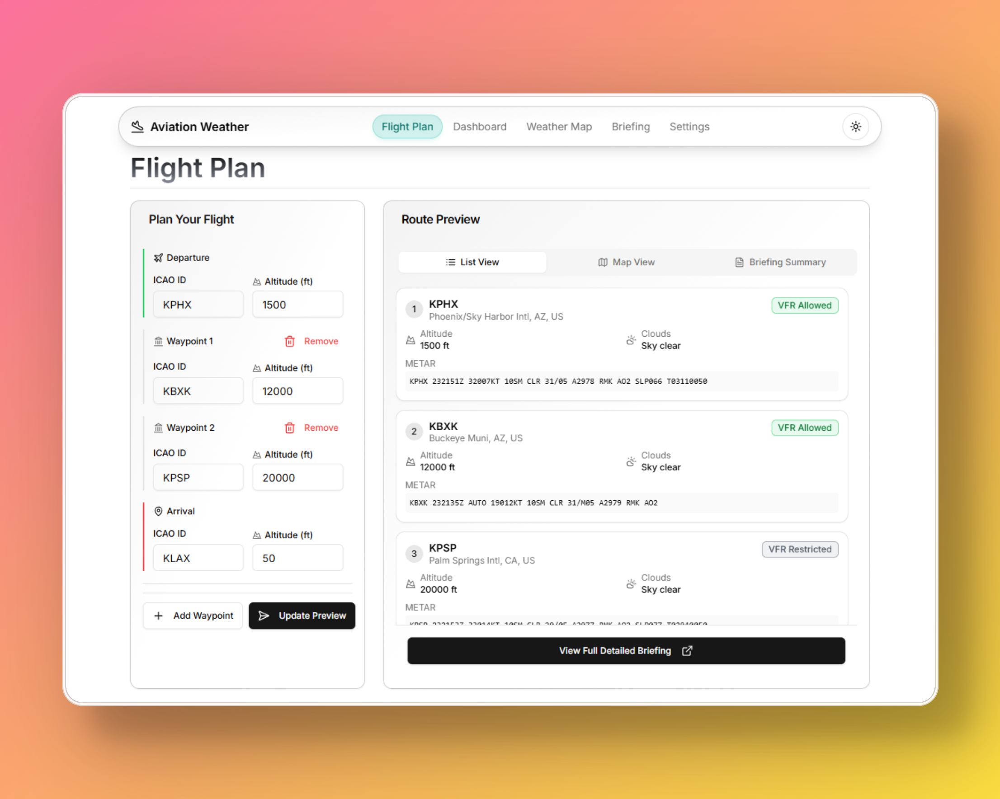
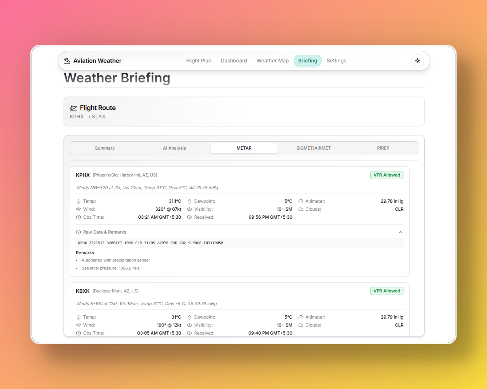
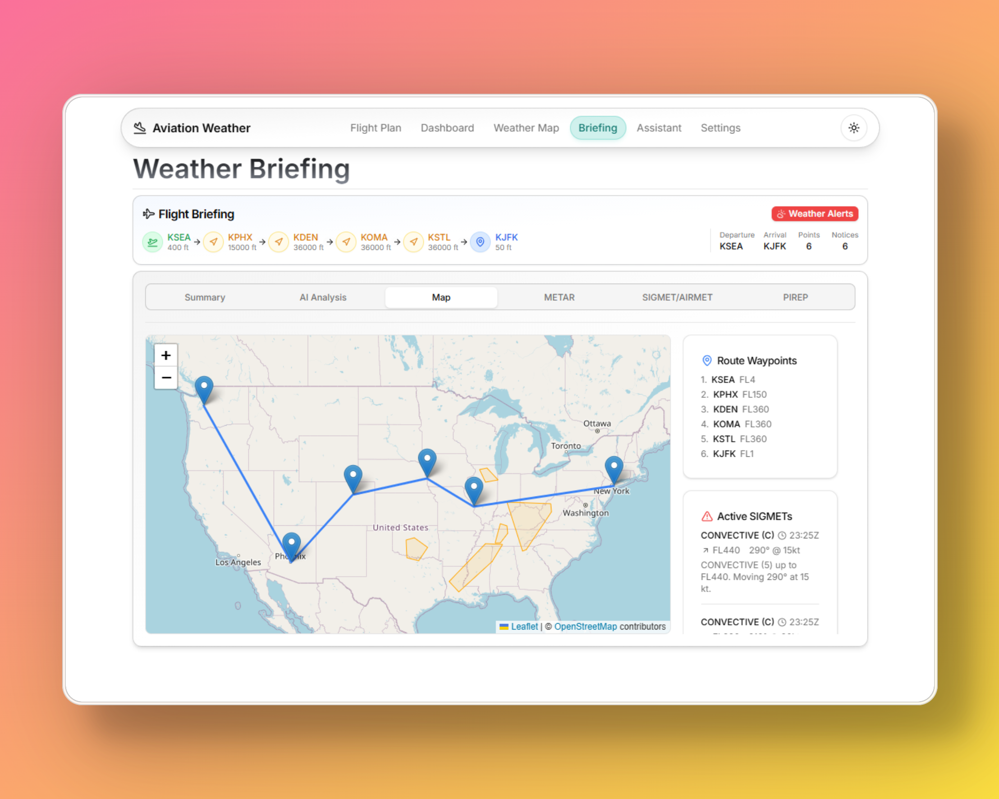
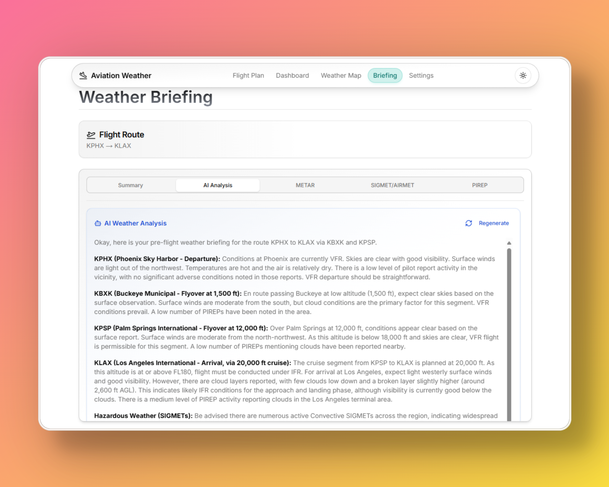
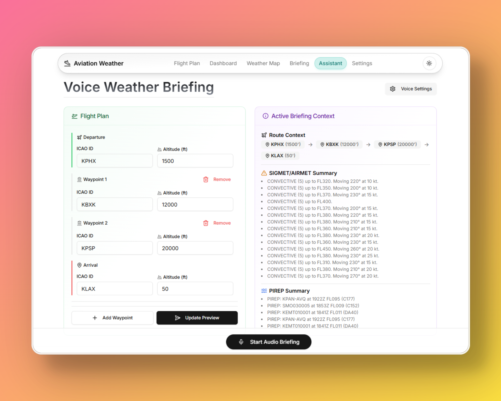

# Aviation Weather [Honeywell Designathon 2025 2nd Place Winner]

## Problem Statement

Pilots must gather and analyze extensive weather data before a flight, which is a time-consuming
and complex process due to the sheer volume and coded nature of the information. This high
workload can overwhelm the flight crew, leading to the risk of ignoring critical reports altogether.

## Solution Overview

Aviation Weather is a web application that provides real-time weather briefings for flight planning. It simplifies the process of gathering and analyzing weather data by providing an intuitive interface and AI-powered summaries.



## Key Features

### 1. Flight Planning Interface
- Plan your flight route with multiple waypoints and altitudes
- Intuitive interface for entering ICAO codes and altitudes
- Route visualization using Leaflet.js

### 2. Weather Reports
- **METAR Reports**: Detailed current weather conditions at airports
- **SIGMET Alerts**: Real-time significant meteorological condition alerts
- **PIREP Information**: Pilot reports for real-world weather conditions
- **TAF Reports**: Terminal Aerodrome Forecasts






### 3. Additional Features
- **AI-Powered Weather Summary**: Summary of METAR, SIGMET, and PIREP information
- **Voice Assistant**: Real-time weather briefings through voice commands powered by Gemini Live API
- **Interactive Weather Map**: Visual weather overlays and route planning
- **Dashboard**: All flight information in one view




## Tech Stack

- **Frontend**: NextJS, TypeScript, TailwindCSS, Shadcn UI, Leaflet.js
- **Backend**: Flask, FastAPI, Python
- **External APIs**: Gemini Live API, aviationweather.gov API
- **Deployment**: Vercel, Render


## Setup Instructions

### Frontend Setup
1. Clone the repository
```bash
git clone https://github.com/CubeStar1/aviation-weather-app
cd aviation-weather-app
```

2. Install dependencies
```bash
npm install
```

3. Create a `.env.local` file with required environment variables
```bash
NEXT_PUBLIC_API_URL=http://localhost:5000
```

4. Run the development server
```bash
npm run dev
```

The application will be available at `http://localhost:3000`

### Backend Setup

The backend API is maintained in a separate repository. For the API setup:
[Aviation Weather API Repository](https://github.com/CubeStar1/aviation-weather-api)

## Input Format

The application accepts flight plans in the following format:
- Airport ID, Altitude, Airport ID, Altitude, Airport ID, Altitude, etc.
- Example: `KPHX,1500,KBXK,12000,KPSP,20000,KLAX,50`
- Airport ID: Standard ICAO ID
- Altitude: In feet

